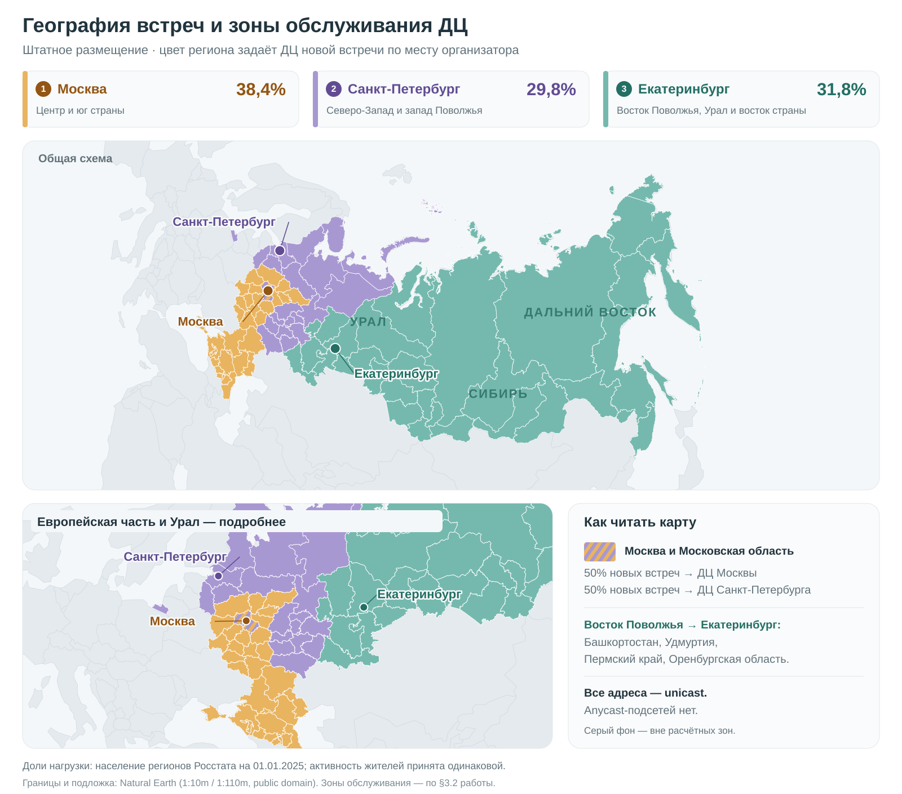

# Проектирование высоконагруженного сервиса видеоконференций «Яндекс Телемост»

Курсовая работа по проектированию высоконагруженных систем.

## 1. Тема и целевая аудитория

### 1.1. Тема и назначение сервиса

Проектируется сервис групповой аудио- и видеосвязи по аналогии с **Яндекс Телемостом**. Он позволяет организовать встречу, пригласить участников по ссылке, общаться в реальном времени, демонстрировать экран и сохранять запись звонка для последующего просмотра. Основные сценарии — рабочие совещания, учебные занятия и личное общение.

Продуктовым ориентиром служит функционал видеовстреч Телемоста: создание встречи по ссылке, передача звука и видео, демонстрация экрана и управление участниками [1]. Ещё один реальный аналог — **Zoom Meetings**, предоставляющий групповые аудио- и видеовстречи и совместную работу с демонстрацией экрана [2]. Наличие действующих продуктов и опубликованные показатели аудитории Телемоста, приведённые ниже, подтверждают существование спроса на такой тип сервиса.

В работе разрабатывается собственная архитектура минимального продукта (MVP) — версии сервиса с основными функциями, перечисленными в §1.4. Параметры проектируемой системы задаются явно; сведения о закрытой внутренней реализации Яндекса не предполагаются.

### 1.2. Целевая аудитория и география

**Целевой рынок проекта — Россия.** Сервис предназначен для пользователей, которым нужно общаться в реальном времени с участниками из разных городов. Основные группы аудитории:

| Группа | Потребность | Сценарий использования |
|---|---|---|
| Сотрудники распределённых команд, специалисты и их клиенты | Обсуждать задачи и материалы без личной встречи | Совещания, собеседования, консультации, демонстрация документов |
| Преподаватели, студенты и участники учебных групп | Проводить занятия с обратной связью | Семинары, консультации, совместная работа над заданиями |
| Частные пользователи | Общаться с близкими и знакомыми на расстоянии | Личные и групповые звонки |

Группы описывают выбранные сценарии проекта, а не измеренную структуру аудитории Телемоста. Один человек может относиться к нескольким группам; их аудитории не суммируются.

Пользователи могут находиться в разных часовых поясах России. При дальнейшем расчёте нагрузки необходимо учитывать время активности по местному времени. Распределение аудитории по регионам будет отдельным допущением модели нагрузки: опубликованных данных для такого распределения в используемых источниках нет.

### 1.3. Размер аудитории

Для размера аудитории используются два показателя: **MAU** (Monthly Active Users) — число уникальных активных пользователей за месяц и **DAU** (Daily Active Users) — за сутки. Повторные действия одного пользователя за тот же период не увеличивают эти показатели.

В качестве ориентиров используются показатели **самого Телемоста**, опубликованные Яндексом:

| Показатель реального аналога | Значение | Публикация | Ограничения данных |
|---|---|---|---|
| Месячная аудитория | Около **8 млн пользователей** | Финансовые результаты Yandex B2B Tech за 2025 год, опубликованы 12.03.2026 [3] | Не указаны точный месяц измерения, методика подсчёта и географическая разбивка |
| Дневная активная аудитория, DAU | **1 млн человек** | Сообщение официального канала Яндекса для инвесторов о Yandex Connect, 30.10.2025 [4] | Не раскрыты период усреднения, методика подсчёта и географическая разбивка |

Эти значения относятся к разным датам. Источники не выделяют аудиторию только выбранных функций MVP в России. Поэтому они используются для обоснования порядка величин, а не как единый статистический срез проектируемого сервиса.

Для проектирования принимается следующая целевая аудитория:

| Параметр модели | Принятое значение | Основание |
|---|---|---|
| География | Россия | Выбранный рынок проекта |
| MAU | **8 000 000 пользователей в месяц** | Проектный масштаб на основе опубликованной месячной аудитории аналога [3] |
| DAU | **1 000 000 пользователей в среднем за сутки** | Проектный масштаб на основе опубликованного DAU аналога [4]; усреднение за календарные дни месяца — допущение модели |
| Активный пользователь | Пользователь, который хотя бы один раз присоединился к видеовстрече, открыл список своих записей или скачал запись за рассматриваемый период | Определение для модели проекта; повторные действия в этом периоде не увеличивают число уникальных пользователей |

MAU и DAU здесь включают организаторов и остальных участников, в том числе гостей. Организатор, который только скачал запись прошлой встречи, также учитывается как активный пользователь. Число пользователей не равно числу подключений или скачиваний: один пользователь может участвовать в нескольких встречах и получать несколько записей. Для гостей без аккаунта подсчёт уникальных людей между устройствами будет оценочным; в модели аудитории предполагается отсутствие повторного учёта одного человека. При расчёте нагрузки активность во встречах и работа с записями будут учитываться отдельно; принятые значения MAU и DAU относятся к сервису в целом.

Это целевая нагрузка зрелого сервиса с ограниченным набором функций MVP.

### 1.4. Ключевой функционал MVP

В MVP входят **шесть функций**. Таблица определяет, как должен работать проектируемый сервис.

| № | Функция | Что может сделать пользователь |
|---|---|---|
| 1 | Создание встречи и приглашение | Авторизованный пользователь создаёт встречу, становится её организатором и получает ссылку, которую может передать другим людям |
| 2 | Подключение к встрече и выход | Пользователь открывает ссылку, проверяет камеру и микрофон, присоединяется после допуска организатора и видит список участников. Участник может выйти и повторно подключиться к ещё активной встрече |
| 3 | Групповая аудио- и видеосвязь | Участники разговаривают и видят видео собеседников. Каждый управляет собственными микрофоном и камерой; участие только со звуком допускается |
| 4 | Демонстрация экрана | Участник показывает экран или окно приложения и может остановить показ; остальные участники видят демонстрацию и продолжают голосовое обсуждение |
| 5 | Управление встречей | Организатор допускает или отклоняет ожидающих пользователей, выключает микрофон участника, удаляет участника и может завершить встречу для всех |
| 6 | Запись и сохранение звонка | Организатор запускает и останавливает серверную запись; все участники видят, что она ведётся. После обработки организатор находит готовый файл в списке своих записей и скачивает его для просмотра на устройстве |

Далее комнатой называется серверное пространство одной встречи: в нём хранятся сведения об участниках и состоянии звонка. Одна активная встреча соответствует одной активной комнате. Комната ожидания используется отдельно для ещё не допущенных пользователей.

Точные ограничения MVP определены далее как решения данного проекта.

### 1.5. Ключевые продуктовые решения

Следующие ограничения приняты для учебного проекта. Они не описывают лимиты реального Телемоста.

| Область | Решение | Обоснование |
|---|---|---|
| Клиенты | Веб-клиент для компьютера и мобильные приложения; общий серверный функционал | Поддерживаются участие с рабочего места и подключение со смартфона |
| Доступ | Создание встречи требует аккаунта. Присоединение возможно с аккаунтом или как гость по ссылке; для всех, кроме организатора, используется комната ожидания | Гость может участвовать без регистрации, а организатор контролирует доступ. Знание ссылки само по себе не даёт права слушать встречу |
| Идентификация | Вход в аккаунт обеспечивается внешней системой идентификации, аналогичной Яндекс ID; разработка этой системы не входит в проект | В проекте сосредоточено управление встречами и их участниками |
| Размер встречи | До **100 одновременно подключённых участников**, включая организатора; ожидающие допуска не считаются подключёнными участниками | Выбранный предел покрывает рабочие совещания и учебные группы и ограничивает размер одной комнаты. Он не используется как средний размер встречи |
| Длительность и завершение | Ограничения по длительности непустой встречи нет. Встреча завершается организатором, при явном выходе последнего участника либо после **5 минут без подключённых участников**. При обрыве связи в этот период можно восстановить подключение. После завершения ссылка недействительна | Участники могут восстановить связь после кратковременного сбоя; пустые комнаты автоматически закрываются. Завершённую встречу нельзя открыть заново по старой ссылке |
| Видео участников | Камера — до **720p, 30 кадров/с**. Клиент одновременно получает не более **9 видеопотоков других участников**; остальные доступны при переключении отображаемой группы. Звук не ограничен выбранной группой видео | Видимая группа ограничивает потребление сети и ресурсов устройства; все присутствующие сохраняют возможность участвовать в разговоре |
| Демонстрация экрана | Одновременно демонстрирует **один участник**, до **1080p, 15 кадров/с**. Демонстрация передаётся дополнительно к выбранным видео участников | Приоритетный сценарий — чтение документов и презентаций; одновременный показ нескольких экранов не требуется |
| Недостаточная пропускная способность | Качество видео и демонстрации может снижаться; сохранение разборчивой речи приоритетнее качества изображения | Пользователь должен иметь возможность продолжать обсуждение при ухудшении соединения |
| Управление записью | Запись по умолчанию выключена. Запустить и остановить её может только организатор, находящийся во встрече; одновременно ведётся одна запись. Все участники, включая присоединившихся позднее, видят индикатор. Выход организатора не прерывает запись, пока встреча продолжается. Запись автоматически останавливается при завершении встречи или по достижении **4 часов**; после остановки можно начать новую запись в той же активной встрече | Запись включается явно и не зависит от соединения организатора. Предел одного интервала записи ограничивает размер файла и объём его обработки, сохраняя возможность продолжать длинную встречу |
| Содержимое записи | Каждый интервал от запуска до остановки сохраняется в **один MP4-файл** с общим звуком участников. При демонстрации записывается экран, в остальное время — видео текущего говорящего; при отсутствии видео используется заглушка. Записываются только допущенные участники | Один готовый файл позволяет пересмотреть обсуждение и материалы без сборки отдельных потоков пользователем |
| Хранение и получение записи | Обработка и хранение выполняются на стороне сервиса. Организатор видит состояния «Обрабатывается», «Готова» или «Ошибка»; скачать можно только готовую запись. Список записей и скачивание доступны только авторизованному организатору, независимо от действительности ссылки на встречу. Запись хранится **30 дней с момента остановки**, затем автоматически удаляется | Организатор может получить результат после завершения звонка и скачать его для длительного хранения. Фиксированный срок ограничивает объём серверного хранилища |

Указанные разрешения и частота кадров — верхние границы качества: 720p и 1080p обозначают соответственно 720 и 1080 строк изображения. Битрейт — объём данных, передаваемый за секунду, обычно в битах/с. Средние битрейты, доли включённых камер, длительность участия и распределение размеров встреч определяются отдельно при расчёте нагрузки; все участники не предполагаются постоянно передающими видео максимального качества. Предел записи в 4 часа и срок хранения 30 дней — проектные допущения. Для записей отдельно будут заданы доля записываемых встреч, средняя длительность и битрейт готового файла, а также число скачиваний; ограничение длительности записи не используется как её средняя длительность.

### 1.6. Границы проекта

В проект входит серверная часть, необходимая для создания встреч, контроля доступа, ведения состояния участников, передачи медиа между ними, а также создания, обработки, хранения и выдачи записей. Для клиентов описываются значимые для нагрузки действия и ограничения.

За пределами MVP остаются:

- личные и групповые чаты, обмен файлами и адресная книга;
- встроенный просмотр и редактирование записей, расшифровка и автоматические конспекты;
- массовые трансляции и вебинары с отдельной ролью зрителя;
- календарь, повторяющиеся встречи и рассылка напоминаний;
- телефония и интеграция с оборудованием переговорных;
- биллинг, тарифы и администрирование корпоративных организаций.

Архитектурную сложность выбранного MVP определяют длительные одновременные подключения, распространение медиапотоков между участниками, согласование состояния комнат, восстановление связи при сбоях и обработка записей. Поэтому в последующих разделах нагрузка будет оцениваться не только в RPS (Requests Per Second — числе запросов в секунду), но и в количестве одновременных участников и записей, объёме медиатрафика, размере хранилища и трафике скачивания записей.

## 2. Расчёт нагрузки

### 2.1. Входные данные

Масштаб проекта — **8 млн MAU и 1 млн DAU** (§1.3). Одно **участие** — присутствие одного человека в одной встрече. Параметры аналогов используются как ориентиры; выбранные допущения относятся к проектируемому сервису.

| Параметр | Принятое значение | Источник / обоснование |
|---|---|---|
| Пользователи звонков за сутки | `U = 900 000` | Допущение: остальные сценарии активности связаны с записями |
| Пользователи списка записей / пересечение с пользователями звонков | `U_list = 200 000`, `U_both = 100 000` | Допущение; `DAU = U + U_list − U_both = 1 млн` |
| Участий на пользователя звонков в день | `f = 2` | Верхняя граница умеренной активности 1–2 встречи в день из исследования МТС Линк и J’son & Partners [10]; выбранный сценарий, не измеренное среднее |
| Участников во встрече в среднем | `n̄ = 4` | Средний размер встречи МТС Линк за 2023 год [8] |
| Средняя длительность встречи | `d = 3 000 с` (50 минут) | Округлённый ориентир Zoom — 52 минуты [9] |
| Демонстрация экрана | `p_screen = 0,5` встреч, `t_screen = 600 с` на показ | Доля округлена с 46,5% по Zoom [9]; один показ на такую встречу и его длительность — допущения |
| Одновременно включённые камеры | `p_camera = 0,5` участников | Допущение. В опросе Zoom 58% предпочли камеру [9], но предпочтение не измеряет время её использования |
| Запись встречи | `p_rec = 0,2` встреч; `r_rec = 1` интервал по `t_rec = 1 200 с` (20 минут) | Допущение; каждый интервал создаёт один файл |
| Битрейт готового MP4 | `b_rec = 1 Мбит/с` | Около 450 МБ/час; ориентир Teams — 400 МБ/час [12] |
| Срок хранения записи | `D_keep = 30 дней` | Продуктовое решение, §1.5 |
| Зарегистрированные аккаунты | `U_profiles = 10 млн` | Допущение, включая неактивные аккаунты; гости отдельных профилей не создают |
| Пик сессий и операций с записями | `K_session = 4` | Среднее за все 24 часа, включая ночь, умножаем на 4: для одновременных участников, комнат, записей и частоты операций с записями |
| Пик команд управления встречей | `K_command = 8 = 4 × 2` | Среднюю частоту команд умножаем на 8: рост активности в 4 раза и двукратный запас на короткие всплески подключений и действий |

Коэффициенты пика — допущения. Данные Microsoft о половине встреч в четырёх часах суток [11] подтверждают неравномерность активности, но не определяют пик одновременных звонков. Выбранные частота и длительность дают 100 минут звонков на пользователя в день — сопоставимо с ориентиром МТС Линк около двух часов [13], хотя состав пользователей в этом среднем не раскрыт.

В модели участник использует одно устройство и присутствует всю встречу; средняя длительность, доли камер, демонстраций и записей одинаковы для всех размеров встреч. Архив и скачивания считаются при стабильном ежедневном выпуске записей и заполненном сроке хранения.

В расчётах `T = 86 400 с` — длительность суток. Переводы единиц: `c_min = 60 с/мин`, `c_byte = 8 бит/байт`, `c_kilo = 1 000` между соседними десятичными единицами (КБ → МБ → ГБ → ТБ). Битрейты переводятся между Мбит/с и Гбит/с тем же множителем; округляются только результаты.

### 2.2. Продуктовые метрики

Число участий получается из аудитории и частоты звонков; число встреч — делением участий на средний размер встречи. Для одновременной нагрузки суммарное время участий или встреч делится на длительность суток.

| Метрика | Формула | Результат |
|---|---|---:|
| Месячная / дневная аудитория | MAU / DAU, §1.3 | 8 млн / 1 млн |
| Участий в сутки | `J = U × f` | 1 800 000 |
| Встреч в сутки | `M = J / n̄` | 450 000 |
| Участий на одного активного за сутки пользователя | `J / DAU` | 1,8 |
| Время звонков на пользователя звонков | `f × d / c_min` | 100 минут/сутки |
| Одновременных участников: среднее / пик | `C = J × d / T`; `C_peak = C × K_session` | 62 500 / 250 000 |
| Одновременных комнат: среднее / пик | `R = M × d / T`; `R_peak = R × K_session` | 15 625 / 62 500 |
| Встреч с демонстрацией в сутки | `N_screen = M × p_screen` | 225 000 |
| Новых записей в сутки | `N_rec = M × p_rec × r_rec` | 90 000 |

#### 2.2.1. Действия пользователя за сутки

Частоты действий ниже — допущения модели. Среднее на DAU считается по всем 1 млн активных пользователей, включая тех, кто конкретное действие не выполняет. В одной встрече организатор входит без допуска, поэтому допусков `J − M`. В доле `p_end = 0,2` встреч организатор завершает звонок для всех; в остальных участники выходят сами. Эта доля одинакова для всех размеров встреч.

| Действие | Частота / число действий за сутки | На DAU в сутки |
|---|---|---:|
| Создать встречу | Один раз на встречу: `M` | 0,45 |
| Получить сведения о встрече | Один раз на участие: `J` | 1,8 |
| Подключиться | Один раз на участие: `J` | 1,8 |
| Допустить участника | `J − M` | 1,35 |
| Изменить камеру/микрофон | `f_media = 4` раза на участие: `f_media × J` | 7,2 |
| Выбрать получаемые видео | `f_select = 1` раз на участие: `f_select × J` | 1,8 |
| Начать демонстрацию | `N_screen` | 0,225 |
| Остановить демонстрацию | `N_screen` | 0,225 |
| Управлять участником | `f_moderate = 0,1` команды на встречу: `f_moderate × M` | 0,045 |
| Выйти самостоятельно | `(1 − p_end) × J` | 1,44 |
| Завершить встречу для всех | `p_end × M` | 0,09 |
| Начать запись | `N_rec` | 0,09 |
| Остановить запись | `N_rec` | 0,09 |
| Получить список записей | `f_list = 2` раза на пользователя списка: `U_list × f_list` | 0,4 |
| Проверить готовность записи | `f_status = 3` раза на файл: `N_rec × f_status` | 0,27 |
| Скачать запись | `f_download = 1,5` полных скачивания на файл за срок хранения; `N_download = N_rec × f_download` | 0,135 |
| **Итого** | **17 410 000 действий/сутки** | **17,41** |

В базовом сценарии демонстрация и запись останавливаются вручную. Частота скачиваний относится ко всему сроку хранения файла; при стабильном выпуске записи разных дней суммарно дают `N_download = 135 000` скачиваний/сутки.

#### 2.2.2. Среднее хранение на пользователя

Количество объектов и объём из §2.3.1 делятся на указанную аудиторию. Это средние значения, а не пользовательские квоты; временные файлы обработки сюда не входят.

| Тип данных | База усреднения | Объектов на пользователя | ГБ на пользователя |
|---|---|---:|---:|
| Готовые записи | MAU — 8 млн | 0,3375 | 0,050625 |
| Метаданные записей | MAU — 8 млн | 0,3375 | 0,000000675 |
| Профиль аккаунта | Зарегистрированные аккаунты — 10 млн | 1 | 0,000001 |

### 2.3. Технические метрики

#### 2.3.1. Хранение и обработка записей

Один интервал записи сохраняется в один MP4 с общим звуком и изображением (§1.5). Его размер `S_rec = b_rec × t_rec / c_byte / c_kilo = 0,15 ГБ` не зависит от числа участников. Ежедневный выпуск: `V_rec_day = N_rec × S_rec = 13 500 ГБ/сутки`; файлов в архиве: `N_archive = N_rec × D_keep = 2,7 млн`.

Временные файлы — рабочие копии, которые могут понадобиться при формировании записи и её загрузке в постоянное хранилище; после успешного сохранения их удаляют. Предварительный запас места равен `D_tmp = 1 день` выпуска (13,5 ТБ). Необходимость отдельных копий и размер резерва уточняются при выборе способа записи.

Метаданные — владелец, состояние, время и расположение записи; бюджет одного описания `S_meta = 2 КБ`. Бюджет профиля аккаунта `S_profile = 1 КБ`. Эти размеры служебных данных — допущения.

| Тип данных | Количество объектов | Расчёт объёма в ТБ | Объём, ТБ |
|---|---:|---|---:|
| Готовые записи | 2,7 млн | `N_archive × S_rec / c_kilo` | 405 |
| Временные файлы (резерв) | Эквивалент 90 тыс. средних файлов | `V_rec_day × D_tmp / c_kilo` | 13,5 |
| Метаданные записей | 2,7 млн | `N_archive × S_meta / c_kilo³` | 0,0054 |
| Профили аккаунтов | 10 млн | `U_profiles × S_profile / c_kilo³` | 0,01 |
| **Итого, одна копия полезных данных** | — | — | **≈419** |

#### 2.3.2. RPS по типам запросов

Для каждой операции число действий за сутки `N_day` берётся из §2.2.1: **средний RPS = `N_day / T`**, пиковый — средний × `K_command` для управления встречами или × `K_session` для операций с записями. Английские имена обозначают операции модели; звук и видео учитываются отдельно как сетевой трафик.

| Операция | Средний RPS | Пиковый RPS |
|---|---:|---:|
| Создать встречу — `CreateMeeting` | 5,21 | 41,67 |
| Получить сведения — `GetMeeting` | 20,83 | 166,67 |
| Подключиться — `JoinMeeting` | 20,83 | 166,67 |
| Допустить участника — `AdmitParticipant` | 15,63 | 125,00 |
| Изменить камеру/микрофон — `UpdateMediaState` | 83,33 | 666,67 |
| Выбрать видео — `SelectVideoStreams` | 20,83 | 166,67 |
| Начать демонстрацию — `StartScreenShare` | 2,60 | 20,83 |
| Остановить демонстрацию — `StopScreenShare` | 2,60 | 20,83 |
| Управлять участником — `ModerateParticipant` | 0,52 | 4,17 |
| Выйти самостоятельно — `LeaveMeeting` | 16,67 | 133,33 |
| Завершить встречу — `EndMeeting` | 1,04 | 8,33 |
| Начать запись — `StartRecording` | 1,04 | 4,17 |
| Остановить запись — `StopRecording` | 1,04 | 4,17 |
| Получить список записей — `ListRecordings` | 4,63 | 18,52 |
| Проверить готовность — `GetRecordingStatus` | 3,13 | 12,50 |
| Запросить скачивание — `GetRecordingDownload` | 1,56 | 6,25 |
| **Итого** | **201,50** | **1 566,44** |

Суммарный пик `RPS_peak ≈ 1 566,44` предполагает совпадение всплесков операций. Дополнительный коэффициент `k_retry = 1,2` покрывает повторные команды, отказанные подключения и восстановление сессий: `RPS_capacity = RPS_peak × k_retry ≈ 1 880`, округлённая цель — **1 900 запросов/с**.

Клиенты поддерживают постоянные сигнальные соединения для допуска, команд и уведомлений. При среднем ожидании `t_wait = 30 с` одновременно ожидают `C_wait_peak = (J − M) / T × K_command × t_wait = 3 750` пользователей. Вместе с участниками это `C_signal_peak = C_peak + C_wait_peak = 253 750` соединений.

Для проверки связи (heartbeat) принят проектный интервал `t_heartbeat = 30 с`. Один служебный обмен — проверка и ответ; проверки равномерно распределяются по времени. При пиковом числе соединений `C_signal_peak / t_heartbeat` даёт **8 459 обменов/с** после округления вверх. Эта нагрузка учитывается при выборе сигнальных серверов отдельно от пользовательского RPS.

#### 2.3.3. Сетевой трафик

Используется SFU — сервер выборочной пересылки медиапотоков [7]. Участник отправляет серверу звук, при включённой камере — один вариант её видео, при демонстрации — экран; сервер пересылает копии другим участникам. Входящий трафик идёт от клиентов к сервису, исходящий — обратно.

| Поток | Битрейт | Основание |
|---|---:|---|
| Аудио `a` | 0,08 Мбит/с | Кодирование речи 32 Кбит/с в диапазоне Opus [5]; сетевой бюджет по ориентиру Zoom 60–80 Кбит/с [6] |
| Камера `v` | 1,8 Мбит/с | Предел 1,5 Мбит/с в примере LiveKit 720p30 [14] + 20% сетевых расходов; бюджет потока, не измеренное среднее |
| Экран `s` | 3 Мбит/с | Предел кодирования 2,5 Мбит/с в профиле LiveKit 1080p15 [15] + 20% сетевых расходов; бюджет потока, не измеренное среднее |

Битрейты уже включают сетевые расходы; запас 20% для камеры и экрана — допущение проекта. Для передачи файлов отдельно принят коэффициент `k_file = 1,05` — 5% сверх размера MP4; хранимый файл от этого не увеличивается.

**Число пересылаемых потоков.** Для комнаты с `n` участниками и `c = n × p_camera` камерами лимит чужих видео `L_video = 9` (§1.5). Число доставок звука — `F_audio(n) = n × (n − 1)`, видео — `F_video(n, c) = c × min(c − 1, L_video) + (n − c) × min(c, L_video)`. Доставка — одна копия потока одному получателю. Собственное видео не возвращается отправителю.

Распределение размеров встреч — допущение. Доли относятся к встречам; средние в последней строке получены умножением каждого значения на долю соответствующих встреч и сложением результатов.

| Участников `n` | Доля встреч | Камер `c` | Доставок видео `F_video` | Доставок звука `F_audio` |
|---:|---:|---:|---:|---:|
| 2 | 80% | 1 | 1 | 2 |
| 8 | 15% | 4 | 28 | 56 |
| 24 | 5% | 12 | 216 | 552 |
| **Среднее на комнату** | — | **2** | **15,8** | **37,6** |

Средний размер этого распределения равен `n̄ = 4`. Средние из таблицы обозначим `c_avg = 2`, `F_video_avg = 15,8`, `F_audio_avg = 37,6`. Доля времени комнат с демонстрацией `q = p_screen × t_screen / d = 0,1`: экран используется в половине встреч по 10 минут из 50. Его получают все, кроме демонстрирующего — в среднем `n̄ − 1` участников. Для звука заложена передача от всех участников без экономии на молчании.

Средние битрейты сервиса в Гбит/с:

- входящий: `B_in_avg = R × (n̄ × a + c_avg × v + q × s) / c_kilo`;
- исходящий медиа: `B_out_avg = R × (F_audio_avg × a + F_video_avg × v + (n̄ − 1) × q × s) / c_kilo`;
- скачивания: `B_download_avg = N_download × S_rec × k_file × c_byte / T`.

Пик каждого потока равен среднему × `K_session`. Суточный объём: `V_day = B_avg × T / c_byte`, где `B_avg` — средний битрейт соответствующего потока в Гбит/с.

| Внешний поток | Средний, Гбит/с | Пиковый, Гбит/с | Объём, ГБ/сутки |
|---|---:|---:|---:|
| Аудио от клиентов | 5,00 | 20,00 | 54 000 |
| Камеры от клиентов | 56,25 | 225,00 | 607 500 |
| Демонстрация от клиентов | 4,69 | 18,75 | 50 625 |
| **Всего входящего медиа** | **65,94** | **263,75** | **712 125** |
| Аудио клиентам | 47,00 | 188,00 | 507 600 |
| Камеры клиентам | 444,38 | 1 777,50 | 4 799 250 |
| Демонстрация клиентам | 14,06 | 56,25 | 151 875 |
| Скачивание записей | 1,97 | 7,88 | 21 263 |
| **Всего исходящего медиа и файлов** | **507,41** | **2 029,63** | **5 479 988** |

На команды, уведомления и проверки соединений принят резерв `B_control = 1 Гбит/с` в каждом направлении. С ним внешнему каналу требуется **≈265 Гбит/с на вход и ≈2 031 Гбит/с на выход** в пике. Резерв не считается постоянно передаваемым суточным объёмом; загрузка приложения и обновлений в оценку не входит.

**Внутренний трафик.** Для пользователей корпоративных и учебных сетей предусмотрен TURN — промежуточный сервер для подключения к SFU, когда прямое соединение недоступно. SFU может поддерживать прямые подключения по UDP и TCP; при более строгих ограничениях помогает TURN/TLS — передача через TURN по защищённому TLS-соединению [17]. Использование TURN подтверждается и официальными сетевыми настройками Телемоста [16].

Для предварительной оценки примем долю медиатрафика через TURN `p_turn = 0,15` — допущение, зависящее от сетей пользователей и поддерживаемых способов подключения. Участок клиент ↔ TURN уже входит во внешний канал. Нагрузка TURN ↔ SFU в таблице считается межсерверной только при размещении компонентов на разных узлах; способ размещения будет выбран далее.

Для записи обработчик получает звук всех участников и один визуальный поток: экран в доле времени `q`, иначе камеру говорящего. Готовый файл формируется по мере записи. Пиковое число одновременно записываемых встреч: `C_rec_peak = N_rec × t_rec / T × K_session = 5 000`.

| Участок | Расчёт пика, Гбит/с | Пик, Гбит/с |
|---|---|---:|
| TURN ↔ SFU, оба направления, при раздельном размещении | `p_turn × (B_in_avg + B_out_avg) × K_session` | ≈343 |
| SFU → обработчики записи | `C_rec_peak × (n̄ × a + (1 − q) × v + q × s) / c_kilo` | 11,2 |
| Обработчики → хранилище | `C_rec_peak × b_rec × k_file / c_kilo` | 5,25 |

Для отдельной комнаты на предельные 100 участников со всеми включёнными камерами и одним экраном требуется **191 Мбит/с на вход и 2 709 Мбит/с на выход**. Эту нагрузку учитываем при распределении встреч по серверам. Копирование данных для надёжности и передачи между дата-центрами будут добавлены при выборе размещения компонентов.

## 3. Глобальная балансировка нагрузки

### 3.1. Расположение дата-центров

Используются **три активных ДЦ: Москва, Санкт-Петербург и Екатеринбург**. В каждом работают управление встречами, SFU, TURN и обработчики записи. На карте указаны районы размещения, а не конкретные здания.

*Цвет региона соответствует ДЦ новой встречи по месту организатора (§3.2). Москва и область заштрихованы двумя цветами: по 50% встреч в Москве и Санкт-Петербурге. Границы — Natural Earth [24]. Все адреса — unicast; Anycast-подсетей нет.*

| ДЦ | Почему выбран этот город |
|---|---|
| Москва | Площадка рядом с крупнейшей агломерацией и центральной частью аудитории. Есть коммерческие ЦОД Selectel [19] и узел обмена трафиком MSK-IX [18] |
| Санкт-Петербург | Вторая площадка на западе страны: обслуживает Северо-Запад и принимает часть нагрузки европейской России. Есть ЦОД Selectel [19] и узел MSK-IX [18] |
| Екатеринбург | Площадка для востока Поволжья, Урала, Сибири и Дальнего Востока. Такой охват даёт существенную собственную нагрузку без переноса сюда встреч из Москвы ради равных долей. Есть ЦОД Key Point [20] и узел MSK-IX [18] |

Разнесение по городам уменьшает зависимость от одной площадки. Требуются независимое питание и минимум два оператора с разнесёнными трассами. Географическая близость помогает сократить задержку звука и видео, но не определяет сетевой маршрут. **RTT** — время прохождения пакета до сервера и обратно — и доступную полосу проверяют перед размещением. Для Дальнего Востока задержка до Екатеринбурга остаётся ограничением схемы.

### 3.2. География и штатная нагрузка

В используемых источниках нет статистики Телемоста по регионам (§1.2). **Допущение:** число организуемых встреч пропорционально населению, а размеры встреч, длительность, использование камер и записей одинаковы во всех регионах. Основа — оценка Росстата на **01.01.2025**, всего **146,12 млн человек** в охвате таблицы [25]. ДЦ встречи определяется по региону организатора; участники из других регионов подключаются к тому же SFU.

| ДЦ | Обслуживаемые регионы организаторов | Население, млн | Доля нагрузки |
|---|---|---:|---:|
| Москва | Центральный округ, кроме половины Москвы и Московской области; Южный и Северо-Кавказский округа | 56,17 | **38,4%** |
| Санкт-Петербург | Северо-Западный округ; половина Москвы и Московской области; запад Приволжского округа | 43,54 | **29,8%** |
| Екатеринбург | Восток Приволжского округа; Уральский, Сибирский и Дальневосточный округа | 46,41 | **31,8%** |
| **Итого** | | **146,12** | **100%** |

Восток Приволжского округа здесь — Башкортостан, Удмуртия, Пермский край и Оренбургская область (**9,77 млн**); запад — остальные субъекты этого округа (**18,64 млн**). Москва и Московская область вместе — **22,05 млн**: половина их новых встреч назначается Москве, половина — Санкт-Петербургу. Доли рассчитаны по неокруглённым численностям [25].

Это проектное разбиение зон обслуживания. **Санкт-Петербург разгружает Москву**, в том числе за счёт западного Поволжья; он не обязательно ближайший ДЦ для этих пользователей. Две западные площадки совместно получают **68,2%** нагрузки; равенство трёх долей не требуется.

Для каждого метода §2.3.2 средний и пиковый RPS умножаются на долю его ДЦ. Например, пик `JoinMeeting` распределяется как **64,1 / 49,7 / 52,9 запросов/с** между Москвой, Санкт-Петербургом и Екатеринбургом. Суммарный средний RPS — **77,5 / 60,0 / 64,0**, пик без повторов — **602,2 / 466,8 / 497,5**. Операции встречи учитываются в ДЦ комнаты; для операций с архивом принят тот же профиль нагрузки.

### 3.3. Число ДЦ и резерв на отказ

Схема рассчитана на **отказ любого одного ДЦ**. Переназначаются комнаты отказавшей площадки; комнаты исправных ДЦ остаются на месте. Таблица описывает отказ при исходном штатном размещении.

| Отказавший ДЦ | Куда направляются его регионы | Москва | Санкт-Петербург | Екатеринбург |
|---|---|---:|---:|---:|
| Нет отказа | Штатные зоны §3.2 | 38,4% | 29,8% | 31,8% |
| Москва | Её часть Центрального округа → Санкт-Петербург; Южный и Северо-Кавказский округа → Екатеринбург | — | 49,8% | 50,2% |
| Санкт-Петербург | Северо-Запад и его половина Москвы и области → Москва; запад Приволжского округа → Екатеринбург | 55,5% | — | 44,5% |
| Екатеринбург | Восток Приволжского и Уральский округ → Москва; Сибирский и Дальневосточный округа → Санкт-Петербург | 53,5% | 46,5% | — |

Аварийное распределение ограничивает перегрузку оставшихся площадок; задержка для перенесённых встреч может увеличиться. Пусть **`P` — общий пик конкретного ресурса из §2**. Мощность ДЦ принимается равной его максимальной доле из таблицы × `P` × **1,2**. Последний множитель — 20% эксплуатационного запаса сверх аварийной нагрузки, отдельно от повторов запросов в §2.3.2. После округления доли мощности вверх до целого процента получаем **`0,67P / 0,60P / 0,61P`** для Москвы, Санкт-Петербурга и Екатеринбурга.

Один ДЦ не переживает отказ площадки. Для двух каждый должен выдерживать весь пик, суммарно с запасом — **`2,4P`**. Для выбранных трёх требуется **`1,88P`**: нагрузка и резерв распределены между двумя западными площадками и Уралом. Одновременный отказ двух ДЦ не покрывается.

В ячейках ниже указаны **штатная нагрузка в общий пик / необходимая мощность с учётом отказа и запаса**.

| Ресурс | Общий пик §2 | Москва | Санкт-Петербург | Екатеринбург |
|---|---:|---:|---:|---:|
| Пользовательские запросы, запросов/с, включая повторы | 1 900 | 731 / 1 273 | 567 / 1 140 | 604 / 1 159 |
| Участники встреч | 250 000 | 96 109 / 167 500 | 74 494 / 150 000 | 79 398 / 152 500 |
| Активные комнаты | 62 500 | 24 028 / 41 875 | 18 624 / 37 500 | 19 850 / 38 125 |
| Сигнальные соединения, включая ожидающих | 253 750 | 97 551 / 170 013 | 75 612 / 152 250 | 80 589 / 154 788 |
| Проверки сигнальных соединений (heartbeat), обменов/с | 8 459 | 3 252 / 5 668 | 2 521 / 5 075 | 2 687 / 5 160 |
| Одновременные записи | 5 000 | 1 923 / 3 350 | 1 490 / 3 000 | 1 588 / 3 050 |
| Внешний входящий трафик, Гбит/с | ≈265 | 102 / 178 | 79 / 159 | 85 / 162 |
| Внешний исходящий трафик, Гбит/с | ≈2 031 | 781 / 1 361 | 606 / 1 219 | 646 / 1 239 |
| TURN ↔ SFU, Гбит/с, сумма направлений, при раздельном размещении | ≈343 | 132 / 230 | 103 / 206 | 109 / 210 |

Частота heartbeat равна числу сигнальных соединений, делённому на 30 с (§2.3.2). Значения округлены вверх до целого; трафик рассчитан от округлённых итогов §2.3.3. Штатно используется примерно **57% / 50% / 52%** установленной мощности, в худшем одиночном отказе — не более 83,4%. Оставшаяся мощность — резерв для отказа, а не предполагаемая равная нагрузка.

Долю медиатрафика через TURN из §2.3.3 — **15%** — принимаем одинаковой во всех ДЦ. Трафик TURN ↔ SFU распределяется по долям нагрузки площадок; резерв рассчитывается по той же схеме отказов. При размещении TURN и SFU на разных серверах одного ДЦ этот трафик проходит внутри ДЦ. Клиентский участок уже включён во внешний трафик и повторно не прибавляется.

### 3.4. Разбиение по доменам

Имена ниже условные; `region` принимает значения `msk`, `spb` или `ekb`.

| Домен | Назначение | Как выбирается ДЦ |
|---|---|---|
| `api.telemost.example` | Создание встречи, получение её адреса, список и состояния записей | GeoDNS по зонам §3.2 с учётом доступности |
| `api-{region}.telemost.example` | Региональная точка входа в API для аварийного переподключения по §3.5 | Конкретный ДЦ API; размещение встречи определяет диспетчер |
| `signal-{region}.telemost.example` | Постоянное соединение для команд и событий встречи | ДЦ, назначенный комнате |
| `sfu-{node}.{region}.telemost.example` | Адрес конкретного SFU; `node` — идентификатор узла | Выдаётся при подключении к комнате |
| `turn-{region}.telemost.example` | Запасной путь передачи медиа к SFU | Тот же ДЦ, что у комнаты |
| `files-{region}.telemost.example` | Скачивание готовой записи по временной ссылке после проверки прав | Доступный ДЦ с копией файла |

### 3.5. DNS и выбор площадки встречи

**GeoDNS выбирает первоначальную точку входа по географии; диспетчер комнат назначает ДЦ и SFU встречи.** Диспетчер — часть сервиса управления встречами. Разделение точки входа и узла комнаты, учёт региона и загрузки применяются, например, в LiveKit [22]; реализация SFU пока не выбрана.

1. GeoDNS оценивает регион по IP DNS-резолвера. Для Москвы и области ответы Москвы и Санкт-Петербурга имеют веса **50/50** [21]. Регион может определиться неточно; DNS не гарантирует распределение комнат в этих долях.
2. При создании встречи диспетчер уточняет регион по IP организатора и применяет зоны §3.2. Для Москвы и области распределяет новые комнаты между двумя западными ДЦ с равными весами, учитывая текущий трафик и свободные ресурсы. Выбранное назначение сохраняется; при неизвестном регионе клиент измеряет RTT до доступных площадок для выбора предпочтительной.
3. При входе в существующую встречу участник получает уже назначенный адрес, независимо от своей точки входа. Все участники подключаются к **одному SFU**, напрямую либо через TURN его ДЦ. Обработчик записи расположен там же; живые медиапотоки между ДЦ не дублируются.
4. Внутри выбранного ДЦ учитываются трафик, соединения и загрузка обработчиков, а не только число комнат. Действующие комнаты не перемещаются ради балансировки; рост комнаты учитывается при допуске участников по свободным ресурсам.

**Переподключение к API.** В веб- и мобильный клиент заранее включены три региональных адреса: `api-msk.telemost.example`, `api-spb.telemost.example` и `api-ekb.telemost.example`. При сетевой ошибке, тайм-ауте или ответе о временной недоступности текущего API клиент последовательно пробует эти адреса в случайном для себя порядке до первого доступного API. Проектный тайм-аут каждой попытки — **5 с**. Ошибки запроса и прав доступа не вызывают переключения. Если все адреса недоступны, обход повторяется с задержкой по правилам §3.6.

Доступный API по идентификатору встречи запрашивает у диспетчера её актуальное назначение и возвращает адреса сигналинга, SFU и TURN. **Клиент выбирает только точку доступа к API; ДЦ встречи и SFU назначает диспетчер.** При отказе ДЦ комнаты используется её сохранённая резервная площадка (§3.6), независимо от ДЦ принявшего запрос API.

Проектные настройки: **TTL 60 с** — срок кеширования DNS-ответа; проверки каждые **5 с**, исключение после **трёх неуспехов подряд**. Доступность API и медиасоединений проверяется отдельно. Авторитативные DNS-серверы размещены в разных ДЦ на отдельных unicast-адресах. TTL не гарантирует время восстановления и не переносит действующие соединения.

**Anycast не применяется:** выбор площадки зависит от зоны обслуживания, загрузки и уже назначенной комнаты; BGP-маршрутизация этим состоянием не располагает. Изменение маршрута также может нарушить длительную сессию [23]. Для проекта достаточно GeoDNS, прямых адресов ДЦ и диспетчеризации комнат.

### 3.6. Отказ ДЦ и регулировка трафика

| Ситуация | Действие |
|---|---|
| Перегрузка | Новые комнаты перенаправляются с учётом RTT и свободных ресурсов. Для каждой сохраняются основной и отличный от него резервный ДЦ; переток допускается, только если сохраняется запас на один отказ. Действующие встречи продолжаются |
| Плановые работы | Новые комнаты не назначаются, действующие завершаются естественно [22]. Если команта не завершается естесственно в течение получаса, завершаем сами              |
| Отказ ДЦ | Он исключается из DNS и назначений. Клиент восстанавливает доступ к API по §3.5; диспетчер восстанавливает комнату в сохранённом резервном ДЦ и возвращает новые адреса подключения |
| Возврат ДЦ | После проверки данных и доступности постепенно возобновляются назначения новых комнат; аварийно перенесённые встречи завершаются на текущих SFU |

Звонки исправных ДЦ продолжаются; затронутые участники **переподключаются к новому SFU**. TURN не заменяет отказавший SFU. Повторы выполняются с нарастающей случайной задержкой и ограничением темпа на сервере; идентификатор операции сохраняется для исключения дубликатов.

Основной и резервный ДЦ каждой комнаты, регион организатора, допуски участников и метаданные записей должны переживать потерю ДЦ. Штатно резервный ДЦ определяется по §3.3; при отклонениях сохраняется отдельное назначение. Незавершённая запись при потере ДЦ получает состояние «Ошибка».

Готовый MP4 хранится в **двух разных ДЦ** по сохранённому основному и резервному назначению комнаты. Статус «Готова» выставляется после подтверждения обеих копий. Штатно файл скачивается из основного ДЦ, при отказе — из резервного по новой ссылке API. Для записей, созданных во время отказа, используются обе исправные площадки. Вторая копия добавляет **405 ТБ** к архиву §2.3.1. Копирование вслед за выпуском записей даёт **1,31 Гбит/с** в среднем (`13 500 ГБ/сутки × 8 × 1,05 / 86 400 с`), ориентир пика — **5,25 Гбит/с** на всю систему. Это отдельный межДЦ-трафик; восстановление утраченных копий ограничивается дополнительно, чтобы не вытеснять звонки.

## Источники

Дата обращения к источникам 1–4: **10.09.2026**, к источникам 5–7: **21.09.2026**, к источникам 8–14: **01.10.2026**, к источникам 15–26: **07.10.2026**. Показатели аудитории приведены с датами публикаций; продуктовые ограничения и расчётные допущения проекта обозначены отдельно.

1. [Яндекс Телемост для бизнеса в браузере][1]. Официальная справка: назначение сервиса и основные возможности.
2. [Zoom Meetings][2]. Официальная страница сервиса: групповые аудио- и видеовстречи, демонстрация экрана.
3. [Yandex B2B Tech объявляет финансовые результаты за 2025 год][3]. Яндекс, **12.03.2026**. Источник месячной аудитории Телемоста: около 8 млн пользователей.
4. [Новости с Yandex Connect][4]. Официальный канал Яндекса для инвесторов YDEX, **30.10.2025**, сообщение № 457. Источник DAU: 1 млн человек.
5. [RFC 6716, раздел 2.1.1: Bitrate][5]. Диапазоны битрейта кодека Opus; сетевые заголовки в эти значения не входят.
6. [Zoom Web App: Bandwidth requirements][6]. Официальные рекомендации по клиентскому каналу для видеосвязи, демонстрации экрана и VoIP; используются как ориентиры, а не как характеристики Телемоста.
7. [RFC 7667, раздел 3.7: Selective Forwarding Middlebox][7]. Принцип серверной выборочной пересылки медиапотоков.
8. [Итоги использования МТС Линк за 2023 год][8]. Пресс-служба МТС Линк, **16.01.2024**: средний размер встречи — четыре участника; вебинары выделены отдельно.
9. [Here’s how you used Zoom in 2022][9]. Zoom, **15.12.2022**: телеметрия за 01.11.2021–31.10.2022 и отдельно опрос 2 800 пользователей в ноябре 2022 года.
10. [J’son & Partners Consulting и МТС Линк: ИИ может экономить до полутора рабочих дней в неделю][10]. Пресс-служба МТС Линк, **04.06.2025**: сценарии с умеренной и высокой интенсивностью встреч, методология исследования корпоративных пользователей.
11. [Breaking down the infinite workday][11]. Microsoft Work Trend Index, **17.06.2025**: суточная концентрация встреч; методика Microsoft 365 Telemetry.
12. [Teams meeting recording storage — Planning for storage][12]. Microsoft Learn: ориентир 400 МБ на час записи, без привязки к фиксированным разрешению и частоте кадров.
13. [Пользователи МТС Линк стали проводить вдвое меньше времени на встречах][13]. Пресс-служба МТС Линк, **25.12.2025**: около двух часов участия в день по итогам 2025 года.
14. [Video track configuration][14]. Официальная документация LiveKit: пример настройки 720p30 с пределом битрейта 1,5 Мбит/с; не измерение среднего трафика.
15. [LiveKit — ScreenSharePresets][15]. Официальный исходный код JS SDK: профиль `h1080fps15` — 1920×1080, 15 кадров/с, предел битрейта кодирования 2,5 Мбит/с.
16. [Сетевые настройки Яндекс 360 — Телемост][16]. Официальная справка: TURN-сервер `turn.webrtc.yandex.net` в списке сетевых ресурсов Телемоста; доля трафика через него не указана.
17. [Connecting to LiveKit — Connection reliability][17]. Официальная документация: прямые подключения по UDP и TCP, использование TURN/TLS при ограничениях на исходящие соединения.
18. [MSK-IX — Internet Exchange][18]. Официальная география точек обмена трафиком, включая Москву, Санкт-Петербург и Екатеринбург.
19. [Дата-центры Selectel][19]. Официальный перечень площадок, в том числе в Москве и Санкт-Петербурге; ориентир доступности инфраструктуры, а не выбранный поставщик проекта.
20. [ГК Key Point — Екатеринбург][20]. Официальная страница действующего операторонезависимого ЦОД на Урале.
21. [Amazon Route 53 — Weighted routing][21]. Принцип взвешенных DNS-ответов и учёта доступности ресурсов; использование AWS в проекте не предполагается.
22. [LiveKit — Distributed multi-region][22]. Разделение входного соединения и узла комнаты, выбор узла с учётом региона, доступности и загрузки, завершение действующих комнат при выводе узла.
23. [RFC 4786 — Operation of Anycast Services][23]. Ограничения Anycast для сервисов, которым необходима устойчивость маршрута в течение сессии.
24. [Natural Earth — Admin 1: States, Provinces][24]. Границы регионов — масштаб 1:10m, фоновая подложка стран — 1:110m. Данные распространяются как [public domain](https://www.naturalearthdata.com/about/terms-of-use/); цвета зон обслуживания заданы по §3.2.
25. [Росстат — оценка численности постоянного населения на 1 января 2025 года][25]. Лист «Всего», столбец G; сумма восьми федеральных округов — 146 119 928 человек. По примечанию источника, без статистики по Донецкой и Луганской народным республикам, Запорожской и Херсонской областям. Используется как демографическая основа модели, не как статистика пользователей сервиса.
26. [RFC 7871 — Client Subnet in DNS Queries][26]. Передача подсети клиента резолвером для географически зависимых DNS-ответов; поддержка зависит от резолвера.

[1]: https://yandex.ru/support/yandex-360/business/telemost/web/ru/
[2]: https://www.zoom.com/en/products/virtual-meetings/
[3]: https://yandex.ru/company/news/12-03-2026-01
[4]: https://t.me/ydex_forinvestors/457
[5]: https://www.rfc-editor.org/rfc/rfc6716.html#section-2.1.1
[6]: https://support.zoom.com/hc/en/article?id=zm_kb&sysparm_article=KB0058323
[7]: https://www.rfc-editor.org/rfc/rfc7667.html#section-3.7
[8]: https://mts-link.ru/blog/records-2024/
[9]: https://www.zoom.com/en/blog/how-you-used-zoom-2022/
[10]: https://mts-link.ru/blog/analitika-json-partners-consulting-i-mts-link/
[11]: https://www.microsoft.com/en-us/worklab/work-trend-index/breaking-down-infinite-workday
[12]: https://learn.microsoft.com/en-us/microsoftteams/tmr-meeting-recording-change#planning-for-storage
[13]: https://mts-link.ru/blog/polzovateli-mts-link-stali-provodit-vdvoe-menshe-vremeni-na-vstrechah/
[14]: https://docs.livekit.io/transport/media/advanced/#video-track-configuration
[15]: https://github.com/livekit/client-sdk-js/blob/53dd8403b52d66aa4e78ac4b43a765341393b102/src/room/track/options.ts#L534-L543
[16]: https://yandex.ru/support/yandex-360/business/admin/ru/network-settings
[17]: https://docs.livekit.io/intro/basics/connect/#connection-reliability
[18]: https://www.msk-ix.ru/en/ix/
[19]: https://selectel.ru/about/data-centers/
[20]: https://www.keypoint-group.ru/cod/ekaterinburg/
[21]: https://docs.aws.amazon.com/Route53/latest/DeveloperGuide/routing-policy-weighted.html
[22]: https://docs.livekit.io/transport/self-hosting/distributed/
[23]: https://www.rfc-editor.org/rfc/rfc4786.html
[24]: https://www.naturalearthdata.com/downloads/10m-cultural-vectors/10m-admin-1-states-provinces/
[25]: https://rosstat.gov.ru/storage/mediabank/OkPopul_Comp2025_Site.xlsx
[26]: https://www.rfc-editor.org/rfc/rfc7871.html
